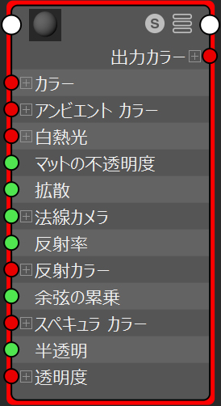

# 普段のスクリプトで呼び出すには

## 準備としてシェーダーを書く
 - オクリュージョンを例として
   - オクリュージョンとは、間接照明のこと
   
 - Propertiesに変数設定
 ```cs
 _Occlusion ("Occlusion" ,Range(0,10)) = 1.0
 ```
 ---
 
 - SubShaderで型を宣言
  
  ```cs
  half _Occlusion;
  ```
  
  - halfとは、数値の型で中精度、浮動小数点値で16ビット。
  - ショートベクトル、方向、オブジェクトの空間位置、HDRカラーに用いられる
    
 - surf関数で接続
 
  - inoutのSurfaceOutputStandardが持ているOcclusionに_Occlusionを代入
 ```cs
 		void surf (Input IN, inout SurfaceOutputStandard o) {
			o.Occlusion =  _Occlusion;
		}
 ```
 
 - SurfaceOutputStandardとは
   - MAYAなどのマテリアル編集画面で最終的に線でつながっている元のところ
   
   
    
    
# 呼び出すには

 - Renderer型で変数定義
 - GetComponentでRenderer取得
 - スライダーの場合 SetFloat で値を代入
 - render.material.SetFloat(シェーダーで定義した変数, 値);
 
 
```cs
    Renderer render;
    float time = 0;

    void Start () {
        render = GetComponent<Renderer>();
	}
	
    void Update () {
        time += 0.1f;

        if(time >= 30)
        {
            time = 0;
        }

        render.material.SetFloat("_Occlusion", time);
    }
```

